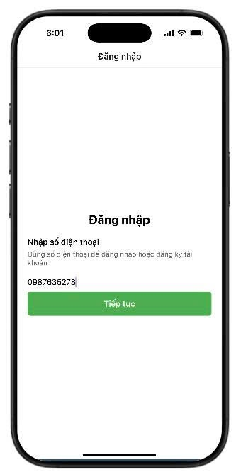
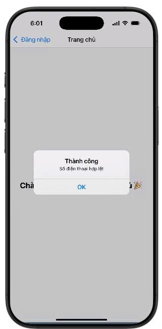
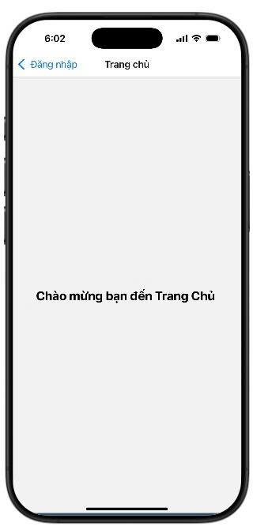

## Bài tập 7.1: Sử dụng Stack Navigation

* Nâng cấp bài **validation số điện thoại** từ bài trước.
* Sử dụng **Stack Navigation** để điều hướng giữa các màn hình.
* Màn hình **SignIn**: Người dùng nhập số điện thoại và hệ thống kiểm tra định dạng.
* Nếu số điện thoại **hợp lệ** và nhấn **Tiếp tục**, ứng dụng sẽ chuyển sang **Home Screen (Trang chủ)**.

